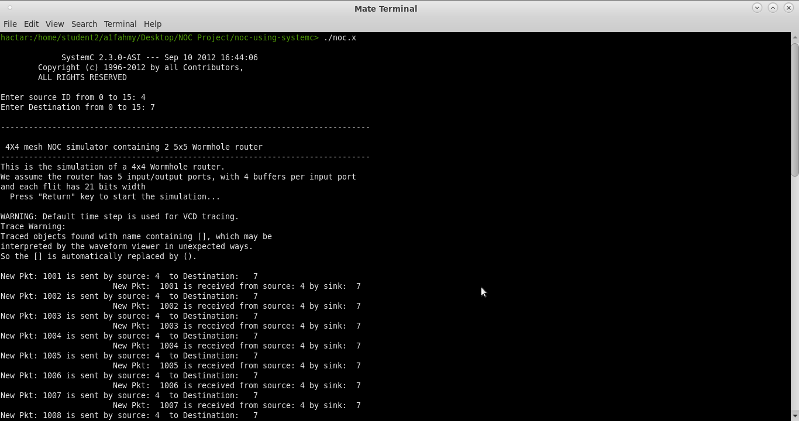
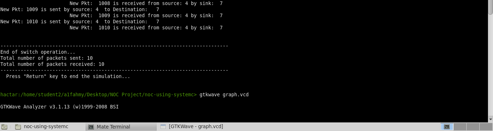
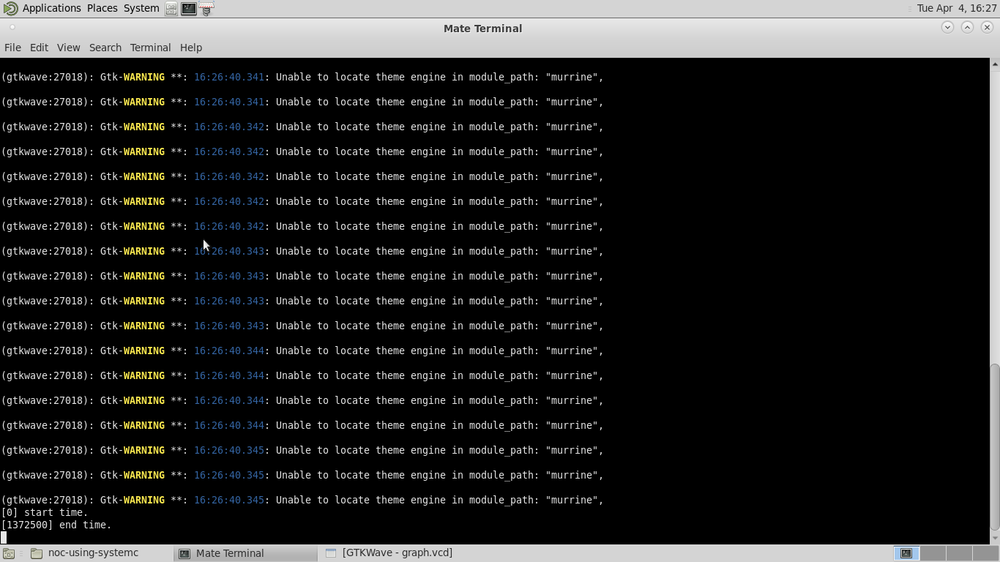
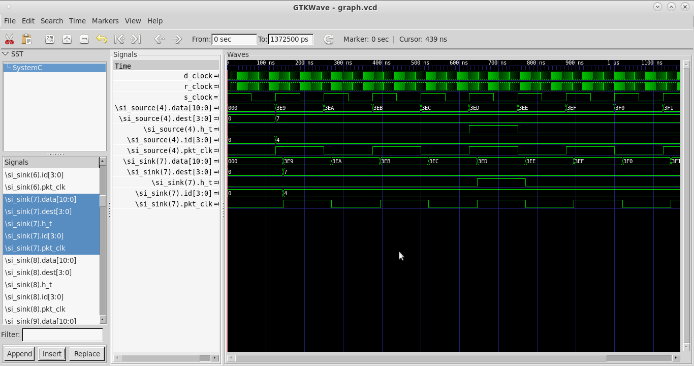

# 4x4 Mesh Network-On-Chip
## **Abstract**

This project interim report provides an overview of a Network-on-Chip (NoC) simulation project developed using SystemC. The report describes the modules and functionality of the NoC design, including the source, sink, and router modules, as well as the arbiter, FIFO, and crossbar modules. The report also discusses the packet structure, clock, and tracing capabilities, and the simulation results obtained from executing the NoC simulation. Overall, the project aims to develop a practical NoC system model for further research and experimentation.

## **Introduction**

The increasing demand for high-performance computing systems has led to the development of complex computer architectures, including Network-on-Chip (NoC) systems. NoCs are an interconnection method that uses packet switching to provide communication between processing elements and memory elements in a System-on-Chip (SoC) design. NoCs provide scalability, flexibility, and better power efficiency compared to traditional interconnects such as busses and point-to-point connections. Due to their importance in modern computing systems, researchers have focused on developing efficient NoC designs (such as RING, tree, mesh, and butterfly) and exploring their characteristics using simulation tools.

In this project, we aim to develop a practical NoC simulation model using SystemC, a C++ library for system-level modeling. The project focuses on a mesh based NoC topology that consists of switches and Ips, where each switch is connected to four adjacent switches and four IP’s. The goal is to develop a modular and scalable NoC simulator that can be extended for from the 2x1 topology to a 4x4 topology. 

The project includes the development of different modules that represent components and functionality of an NoC design. These modules include the source, sink, and router modules, each with their respective input and output ports. The router modules consist of lower-level modules, including the arbiter, FIFO, and crossbar modules, which are responsible for routing and switching techniques in the NoC. Finally, the main function connects all the NoC modules and generates clock and tracing capabilities. 
	
The project’s objectives include the development of a practical NoC simulation model and the analysis of simulation results using visualization tools. This report presents an interim update on the progress of the project, including the description of the NoC simulator’s modules and their functionalities, as well as the results of initial simulations.

## **Problem statement**

The increasing demand for high-performance computing systems has led to the development of NoC architectures as an alternative to traditional bus-based communication systems. NoCs provide a scalable and modular design, allowing for efficient communication between processing elements, memory, and other system components. However, designing an efficient NoC system requires a thorough understanding of its components, including the source, sink, and router modules, as well as the underlying communication protocols and techniques, In this project, we aim to design a scalable and efficient NoC system that meets the demands of modern high-performance computing capabilities.

## **Implementations**

The NoC simulation project aims to model a Network-on-Chip (NoC) system consisting of switches and IPs using SystemC. The project began with a given mesh NoC design, and the goal is to develop a more practical NoC system model. To accomplish this, the NoC simulator is divided into various modules that represent the components and functionality of an NoC design, with each module being a basic container object of SystemC.

The source module produces synthetic or random packets using a message structure. Each message consists of packets formed by a varying number of flits, the smallest element of data that travels inside the NoC at each clock cycle. The sink module accepts packets from the router module and records the number and time of incoming packets. The packet structure includes header and payload flits, with the former needed to route data from the source node to the sink node. Address bits for identifying sender and receiver nodes, a clock bit, and a tail/header bit for determining the end of a packet are also included.

The source module has input ports including source_id, ach_in, traffic_id, and CLK, and an output port called packet_out. It also has three input ports: packet_in, sink_id, and sclk, and one output port, ack_out. The 2D router module has five input and output ports and is used to pass packets from source to sink in mesh-based topologies. The router code has 22 ports including input/output ports for packets and acknowledgments, a router ID port, and a clock input port. This section also discusses the functionality of the arbiter and FIFO modules in the router. The arbiter has eight input ports and six output ports, and its request and grant ports are connected to FIFO buffers. The SystemC code for the arbiter is provided, and it handles requests for output ports and enables the free_out bit related to that output port if it is free. The FIFO module is responsible for buffering incoming flits and requesting the arbiter for output ports. The crossbar module receives flits from the FIFO module and sends them out through their associated output ports. When a flit enters the crossbar module, its associated output port is read from the input port configuration, and the packet is sent out through that output port. The crossbar module has a process called c_func() that is triggered by events on the input ports and reads the configuration address from the config port before sending the packet through its associated output ports. 

Small changes were made to most of the modules these include arbiter.cpp, crossbar.cpp, source.cpp, source.h, sink.cpp, sink.h and main.cpp files, so the implementation is the same as the given code and mentioned below.

The first change was to add four more if-else statements in the each of the buffer request sequences for the 5 request signals, each of these four additional statements correspond to east, south, west, and north, respectively. These statements were added to implement a simple round-robin arbitration scheme to determine which input request signal should be granted to which output grant signal. Next, the changes made in crossbar.cpp were to add the missing cases in each if-statement, they were missing the output channel write cases 0, 1, 2, 3, and 4, in that order for inputs 0, 1, 2, 3, and 4. The code uses the while loop to keep checking for new input packets, and waits for an input event before checking for new packets. The functionality when a new packet arrives on an input channel is the same and a switch statement is used to determine the destination output channel based on the configuration signal; the packet is then written to the appropriate output channel (o0-o4). 

The changes made to the source and sink functionality and header files were the same: it was to add the d_est and ch_k input signals to store the destination field of the packets and a check signal to compare against the source_id/sink_id of the module. Lastly, the main file was changed a lot to implement the additional source and sink modules for the 4x4 mesh topology by adding 16 sink ids, 16 source ids, extending the general ids (id0, id1, etc.) to 16 as well, a scinput integer variable, a 4-bit check signal, and integers i and j for _____. Then all 16 source, sink, and router objects were instantiated and mapped to connect to each of the 16 routers in a 4x4 topology to one source and sink module each, accordingly. Then a trace file was created to capture and display the signal changes using Gtkwave, so trace signals were added for all of the additional signals that were added (sources 0-15, sinks 0-15, and routers 0-15), as well as tracking for the router clock. The user is then asked to input two numbers for the source and sink IDs to send a packet to and from which are saved in the i and j variables. These values are then written and traced. Finally, the packet routing is printed to the terminal to provide tracking information.

## **Observations**
 

Figure 1. Executing noc.x between source 4 and sink 7, then graphing the trace files using Gtkwave

Figure 2. Gtkwave terminal results

Figure 3. Gtkwave results for source 4 and sink 7

## **Results**

The 4x4 mesh topology NoC was successfully implemented, latency was successfully measured during the interim report to be roughly 1ns and had low latency and high throughput for small data transfers within a single cluster but latency increased and throughput decreased for larger transfer between different clusters which indicated the impact of congestion and contention. 

## **Conclusion**

In conclusion, the 4x4 NoC project has demonstrated the feasibility and advantages of using a NoC for on-chip communication. The NoC showed low latency and high throughput for small data transfers within a single cluster, which is particularly important for applications such as multimedia and gaming. However, for larger data transfers between different clusters, the NoC experienced congestion and contention, which could be addressed by adding more routing and flow control mechanisms. Overall, the project has provided valuable insights into the design and implementation of NoCs and has opened new avenues for future research in this area.
